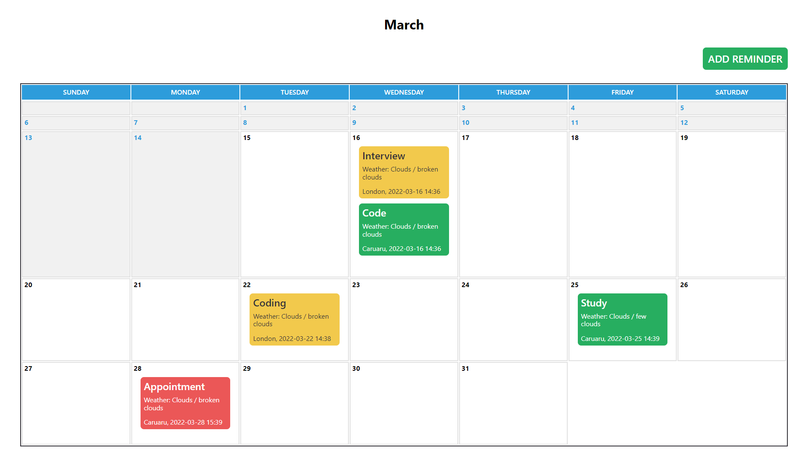

# Calendar Reminder

 

> It is possible to create, delete and update a reminder related to a specific day on the month. With information about the reminder, date, time, city and weather conditions service.

The goal of this exercise is to create a demo calendar application using React.

- Ability to add a new "reminder" (max 30 chars) for a user entered day and time. Also,
include a city.
- Display reminders on the calendar view in the correct time order.
- Allow the user to select color when creating a reminder and display it appropriately.
- Ability to edit reminders – including changing text, city, day, time and color.
- Add a weather service call from a free API such as Open Weather Map, and get the
weather forecast (ex. Rain) for the date of the calendar reminder based on the city.
- Unit test the functionality: Ability to add a new "reminder" (max 30 chars) for a user
entered day and time. Also, include a city

## 🚀 Setup

To install follow these rules:

```
git clone
```

then to install the dependencies:

```
npm install

or

yarn install
```

## ☕ Using

To use, follow these rules:

To start the project:

```
npm run start
```

To run the tests:

```
npm run test
```

## 📫 Contribute

To contribute to the project, follow these steps:

1. Fork this repository.
2. Create a branch: `git checkout -b <branch_name>`.
3. Make your changes and commit them: `git commit -m '<message_commit>'`
4. Push to the original branch: `git push origin <project_name> / <local>`
5. Create the pull request.

Alternatively, see the GitHub documentation at [how to create a pull request](<https://help.github.com/en/github/collaborating-with-issues-and-pull-requests/creating-a-pull-request>).
